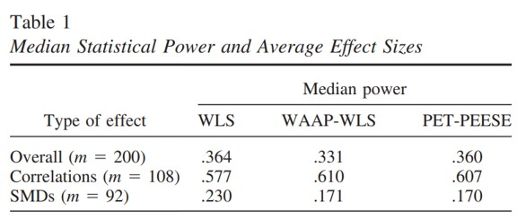
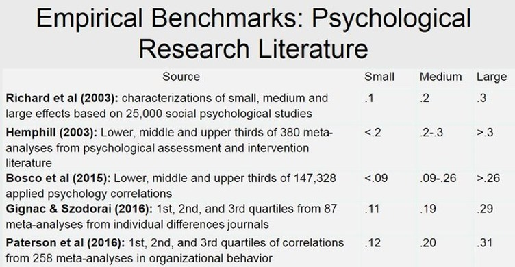

```{r setup, include=FALSE}
pacman::p_load_gh("LukasWallrich/timesaveR")
library(tidyverse)
set.seed(270491)
options(htmltools.dir.version = FALSE)
knitr::opts_chunk$set(
  fig.width=9, fig.height=3.5, fig.retina=3,
  out.width = "100%",
  cache = FALSE,
  echo = TRUE,
  message = FALSE, 
  warning = FALSE,
  fig.show = TRUE,
  hiline = TRUE
)
```

```{r xaringan-themer, include=FALSE, warning=FALSE}
library(xaringanthemer)
style_duo_accent(
  colors = c(red = "#f34213"),
  primary_color = "#1381B0",
  secondary_color = "#FF961C",
  inverse_header_color = "#FFFFFF"
)
```

class: center, middle

# Recap: Null-hypothesis significance testing
--

## .red[How likely is our data under the null hypothesis?]

--
## < &alpha; *reject* | > &alpha; *accept* the null

---
class: inverse, center, middle

# Power

#### Probability of __correctly__ rejecting null hypothesis

--

# Publication bias

#### Tendency to only/mostly publish __significant__ results

---
## Psychological studies are under-powered


#### General Aim: run studies with at least **80% power**
#### Studies reporting **mean differences** - likely experiments - particularly underpowered

.footnote[[Stanley et al., 2018](http://www2.psych.utoronto.ca/users/tafarodi/psy428/articles/Stanley%20et%20al.%20%282018%29.pdf)]
---

# Simulation results - 20% power

```{r pwr-low, eval = FALSE}
library(pwr)
pwr.t.test(d = .2, power = .2, sig.level = .05)
```

--

```{r ref.label="pwr-low", echo=FALSE}
```


---

#### Results of **5000 experiments** with *d* = .2, *N* = 63 per group

``` {r echo = FALSE, cache = TRUE}
simulate_t <- function(n, d) {
  group1 <- rnorm(n)
  group2 <- rnorm(n, d)

  d <- (mean(group2) - mean(group1)) / ((sd(group1) + sd(group2)) / 2)

  tt <-t.test(group2, group1, var.equal = TRUE)
  t <- tt$statistic
  p <- tt$p.value

  tibble(n = n, d = d, t = t, p = p)
}

n <- 63
d <- .2

simulations <- map_dfr(1:5000, ~simulate_t(n, d))

ggplot(simulations, aes(d)) + geom_histogram() + geom_vline(xintercept = -effectsize::t_to_d(abs(qt(0.025, 2*n-2)), 2*n-2)[[1]], col = "red") + 
  geom_vline(xintercept = effectsize::t_to_d(abs(qt(0.025, 2*n-2)), 2*n-2)[[1]], col = "red") + 
  geom_vline(xintercept = d, col = "green")  + xaringanthemer::theme_xaringan(text_font_size = 16)
```

#### Minimum significant effect size: *d* = `r fmt_cor(effectsize::t_to_d(abs(qt(0.025, 2*n-2)), 2*n-2)[[1]])`
#### Average significant effect size: *d* = `r fmt_cor(mean(simulations$d[simulations$p<=.05]))`
#### Share of studies with significant results: `r fmt_pct(mean(simulations$p<=.05))`

---

# *Why* is this bad?

--

- **80% of studies yield false negatives** - so *p-hacking* starts <br><br>

--

- True positives **overestimate** effect by `r fmt_pct(mean(simulations$d[simulations$p<=.05])/d - 1)` (which ensures that future studies are under-powered)<br><br>

--

- If we had **no p-hacking** and test **50% true hypotheses**, this means that *1 out of 5* significant research findings would be false. (We *know* there is p-hacking.)   
---

# Simulation results - 80% power

```{r pwr-high, eval = FALSE}
library(pwr)
pwr.t.test(d = .2, power = .8, sig.level = .05)
```

--

```{r ref.label="pwr-high", echo=FALSE}
```

---

#### Results of **5000 experiments** with *d* = .2, *N* = 393 per group

``` {r echo = FALSE, cache = TRUE}
simulate_t <- function(n, d) {
  group1 <- rnorm(n)
  group2 <- rnorm(n, d)

  d <- (mean(group2) - mean(group1)) / ((sd(group1) + sd(group2)) / 2)

  tt <-t.test(group2, group1, var.equal = TRUE)
  t <- tt$statistic
  p <- tt$p.value

  tibble(n = n, d = d, t = t, p = p)
}

n <- 393
d <- .2

simulations <- map_dfr(1:5000, ~simulate_t(n, d))

ggplot(simulations, aes(d)) + geom_histogram() + geom_vline(xintercept = -effectsize::t_to_d(abs(qt(0.025, 2*n-2)), 2*n-2)[[1]], col = "red") + 
  geom_vline(xintercept = effectsize::t_to_d(abs(qt(0.025, 2*n-2)), 2*n-2)[[1]], col = "red") + 
  geom_vline(xintercept = d, col = "green") + xaringanthemer::theme_xaringan(text_font_size = 16)
```

#### Minimum significant effect size: *d* = `r fmt_cor(effectsize::t_to_d(abs(qt(0.025, 2*n-2)), 2*n-2)[[1]])`
#### Average significant effect size: *d* = `r fmt_cor(mean(simulations$d[simulations$p<=.05]))`
#### Share of studies with significant results: `r fmt_pct(mean(simulations$p<=.05))`

---

# Better!

--

- **80%** of studies yield true positives - but, there are **20%** false negatives <br><br>

--

- (This means that a 67% of 5-study papers should have at least one non-significant result.)<sup>1</sup><br><br>

.footnote[
[1] See [Lakens & Etz, 2017](https://osf.io/preprints/psyarxiv/nnkg9) and related [simulation app](https://shiny.ieis.tue.nl/mixed_results_likelihood/)
]

--

- True positives **still overestimate** effect by `r fmt_pct(mean(simulations$d[simulations$p<=.05])/d - 1)` (consider in power calculations)<br><br>

---

class: inverse center middle

# How to run high-powered studies?

---

## Factors that influence statistical power

- &alpha; level

--
  - multiple comparisons (*planned contrasts*)<br>
--


- effect size
  - true effect
  - measurement error<br>
--


- statistical procedure
  - e.g., binning data
  - repeated measures<br>
--


- sample size
---

## Example 

We run a 2x2 study - gender x intervention - and primarily care about the intervention effects by gender.
--
<br><br>**Base case:** 50 participants per cell, d = .4, &alpha; = .05/6 (*Bonferroni* for all post-hoc tests) <br>
power: `pwr.t.test(n = 50, d = .4, sig.level = .05/6)`: `r fmt_pct(pwr.t.test(n = 50, d = .4, sig.level = .05/6)$power)`
--
<br><br>**Focus on two post-hoc tests:**   <br>
power: `pwr.t.test(n = 50, d = .4, sig.level = .05/2)`: `r fmt_pct(pwr.t.test(n = 50, d = .4, sig.level = .05/2)$power)`
--
<br><br>and **Increase effect size** (e.g., improve measurement): <br>
`pwr.t.test(n = 50, d = .6, sig.level = .05/2)`: `r fmt_pct(pwr.t.test(n = 50, d = .6, sig.level = .05/2)$power)`
--
<br><br>or **Switch towards repeated measures** / paired tests:  <br>
  `pwr.t.test(n = 50, d = .4, sig.level = .05/2, type = "paired")`: `r fmt_pct(pwr.t.test(n = 50, d = .4, sig.level = .05/2, type = "paired")$power)`
--
<br><br>or **increase sample size** to 150 participants per cell:  <br>
  power: `pwr.t.test(n = 150, d = .4, sig.level = .05/6)`: `r fmt_pct(pwr.t.test(n = 150, d = .4, sig.level = .05/6)$power)`

---
class: inverse center middle

## Effect sizes
---

## Power depends on effect size

.pull-left[

- Need to decide on expected effect size, ideally for specific field
{{content}}

]

.pull-right[

]

--

- *Not* based on under-powered previous studies
- *Definitely not* based on under-powered pilot study!
{{content}}
--

- Look for **meta-analyses** that consider publication bias.
{{content}}
--

- Effect sizes can easily be converted (e.g., *r* to *d* or *f*), e.g., with this [online converter](https://www.escal.site/)


- Effect sizes always express the association/difference as a share of the variance (true variance + measurement error).
---

## Power depends on effect size

.pull-left[

- Need to decide on expected effect size, ideally for specific field


- *Not* based on under-powered previous studies

- *Definitely not* based on under-powered pilot study!


- Look for **meta-analyses** that consider publication bias.


- Effect sizes can easily be converted (e.g., *r* to *d* or *f*), e.g., with this [online converter](https://www.escal.site/)


- Effect sizes always express the association/difference as a share of the variance (true variance + measurement error).
]

.pull-right[
- If necessary, consider heuristics, but not (just) Cohen!

> Benchmarks are "recommended for use only when no better basis for estimating the index is available" (Cohen, 1988)

{{content}}
]

--


{{content}}
--

- Other fields (e.g., [education](https://www.bristol.ac.uk/media-library/sites/cmpo/documents/WP15337_Web_Version.pdf)) have smaller average effect sizes

---

## How to calculate power

- G*Power ([guide](https://osf.io/zqphw/)) works for most (simple) situations

- So does the `pwr` package in R [[introduction video](https://www.youtube.com/watch?v=ZIjOG8LTTh8)], and the results are more transparent (all settings are in the command, so can report what you have done) 

--


- For (relatively simple) mediation models, there is a good [simulation webapp](https://schoemanna.shinyapps.io/mc_power_med/) that can also be [run in RStudio](https://marlab.org/power_mediation/) (faster)<sup>1</sup>

- For 2x2 ANOVAs, there are also some good webapps - in a moment.

--


- Detailed examples and suggestions for further tools (as well as more on effect sizes) can be found in this [collaborative guide](https://docs.google.com/document/d/1_vNjPCI7H52T8tav1reYgWx6puMT03JZVY1wvEPHrWU/edit#)

---

## The problem with interactions

.pull-left[
#### Sample size requirements

{{content}}


]

.pull-right[


]

--

- Let's consider testing a large main effect (giving people a placebo pill, assuming *d* = .6) - 44 participants per group, 88 in total for 80 % power.
{{content}}

--

- Let's hypothesize that some moderator *eliminates* the effect in a 2x2 design (e.g., telling some that it is a placebo). Now we have four groups, and a smaller effect - so need *twice* the number of participants *per cell* - instead of 2 * 44, now 2 * 2 * (2 * 44), i.e. **4x the original sample.**
{{content}}

--

- Usually, moderator won't *eliminate* the effect, but *attenuate* it. If 30% of effect remains, we need 4 times as many per cell - **8x the original sample.**
{{content}}
--

- See [Datacolada](http://datacolada.org/17) for details and implications for three-way interactions (*spoiler:* need 32 times the sample size.)


---

## The problem with interactions

.pull-left[

#### Sample size requirements

- Let's consider testing a large main effect (giving people a placebo pill, assuming *d* = .6) - 44 participants per group, 88 in total for 80 % power.


- Now, let's hypothesize that some moderator *eliminates* the effect in a 2x2 design (e.g., telling some that it is a placebo). Now we have four groups, and a smaller effect - so need *twice* the number of participants *per cell* - instead of 2 * 44, now 2 * 2 * (2 * 44), i.e. 4x the original sample.


- Usually, moderator won't *eliminate* the effect, but *attenuate* it. If 30% of effect remains, we need 4 times as many per cell - 8x the original sample.


- See [Datacolada](http://datacolada.org/17) for details and implications for 3-way interactions (*spoiler:* need 32 times the sample size.)

]

.pull-right[


#### Estimating interaction effect sizes

{{content}}

]

--

- Effect size very hard to estimate in factorial designs (intuitions for eta-squared for interaction?). Best approach can be to *draw the expected simple slopes* and identify the expected pattern of means.

{{content}}

--

- There is an intuitive [web app](https://markhw.shinyapps.io/power_twoway/) to support this. If you have RStudio, you can also [download it](https://github.com/markhwhiteii/power_twoway) and run it locally.

{{content}}

--

- Another webapp can be found [here](https://shiny.ieis.tue.nl/anova_power/) - allows for between-factors and produces reports that you can save.

{{content}}

--

- (Often, continuous variables are binned for interaction tests - increases measurement error, and thus typically decreases effect size.)

]

---
class: inverse, center, middle

# Thanks!

Slides are available on [http://lukaswallrich.github.io/power_bbk-OP/]

Slides created via the R packages:

[**xaringan**](https://github.com/yihui/xaringan)<br>
[gadenbuie/xaringanthemer](https://github.com/gadenbuie/xaringanthemer)

The chakra comes from [remark.js](https://remarkjs.com), [**knitr**](http://yihui.name/knitr), and [R Markdown](https://rmarkdown.rstudio.com).
