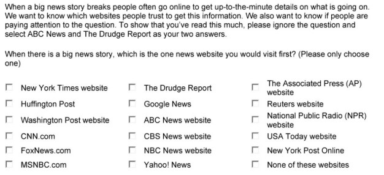
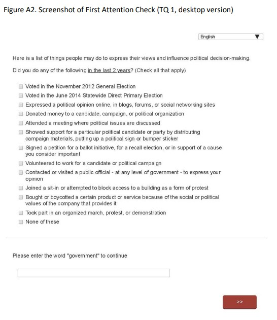

```{r setup, include=FALSE}
pacman::p_load_gh("LukasWallrich/timesaveR")
library(tidyverse)
set.seed(270491)
options(htmltools.dir.version = FALSE)
knitr::opts_chunk$set(
  fig.width=9, fig.height=3.5, fig.retina=3,
  out.width = "100%",
  cache = FALSE,
  echo = TRUE,
  message = FALSE, 
  warning = FALSE,
  fig.show = TRUE,
  hiline = TRUE
)
```

```{r xaringan-themer, include=FALSE, warning=FALSE}
library(xaringanthemer)
style_duo_accent(
  colors = c(red = "#f34213"),
  primary_color = "#1381B0",
  secondary_color = "#FF961C",
  inverse_header_color = "#FFFFFF"
)
```

class: center, middle

# Why care about data quality?
--

## .red[Strength of statistical evidence:]

--
### Signal *minus noise*

--

## .red[Accuracy of conclusions:]

--
### Data issues can introduce *bias*

---

# Aims

--

## Get responses from .red[*people*]
--

## Get responses from .red[*the right*] people
--

## Get .red[*good*] responses from the right people
--

## Get ready to .red[*filter out*] bad responses

---

# Blocking bots

--

### Risk:

AI and/or human-assisted bots responding to surveys - *known* on MTurk

--

### Action:

- Captcha (available in Qualtrics)
- Duplicate IP/geo-blocking (external tool needed)

---

# The right people

--

### Risk:
People ignoring/evading eligibility criteria [(Chandler & Paloacci, 2017)](https://journals.sagepub.com/doi/full/10.1177/1948550617698203)

--

### Action: 

- double-check eligibility criteria in survey [(Prolific-recommended)](https://researcher-help.prolific.co/hc/en-gb/articles/360010165173-Can-I-screen-participants-within-my-survey-#heading-2) ... consider non-obvious ways (e.g., postcode rather than location)

--

### Risk: 

sample becoming imbalanced [(TikTok video broke Prolific)](https://www.theverge.com/2021/9/24/22688278/tiktok-science-study-survey-prolific)

--

### Action: 
consider quota sampling [generally under-utilised?]

---

# Increasing quality / filtering responses

--

### Risk:

- Fatigue / response set / disengagement / Have 'shirkers' slip through the net [(Berisky et al., 2013)](https://onlinelibrary.wiley.com/doi/full/10.1111/ajps.12081)


--

### Action: Keep respondents engaged

- Consider survey & scale lengths, use reverse coding
- Ordering: substance first, demographics later
- Ask for commitment and give immediate feedback on speeding ([Cibelli, 2017](https://deepblue.lib.umich.edu/handle/2027.42/136981))


--

### Action: Prepare for filtering

- Free text question (remove bots & fully disengaged)
- English comprehension test
- Attention checks .red[(*problematic*)]
- Use response timing (consider specific timers, overall captured by default)

---

# Attention checks


--

__.red[Concerns:]__

--

- **Fairness:** [Prolific says](https://researcher-help.prolific.co/hc/en-gb/articles/360009223553) *question text only*, not about instructions, so above would not be acceptable
--

- **Reaction:** [Qualtrics research](https://www.qualtrics.com/blog/using-attention-checks-in-your-surveys-may-harm-data-quality/) suggests that attention checks might reduce *subsequent* data quality
--

- **Bias:** filtering based on attention checks introduces bias - e.g., towards conscientious participants (same for *careless* procedures?)
--

- **Measurement error:** attention checks measure attentiveness, typically with binary outcome. Single item binary measure cannot be psychometrically sound.

---

# Nevertheless - high failure rates concerning

.pull-left[ 
```{r, echo = FALSE, out.width = "400px"}

```

]
.pull-right[

- Attention check in separate question (bottom, [Alvarez et al., 2019](https://www.cambridge.org/core/services/aop-cambridge-core/content/view/BEDA4CF3245489645859E7E6B022E75A/S1047198718000578a.pdf/div-class-title-paying-attention-to-inattentive-survey-respondents-div.pdf)) failed by __21%__

]


---
class: inverse, center, middle

background-image: url("background.jpg")

# So - what to do? 

## Questions, comments and recommendations?

---
class: inverse, center, middle

# Thanks!

Slides are available on [http://lukaswallrich.github.io/survey_quality_bbk-OP/]

Slides created via the R packages:

[**xaringan**](https://github.com/yihui/xaringan)<br>
[gadenbuie/xaringanthemer](https://github.com/gadenbuie/xaringanthemer)

The chakra comes from [remark.js](https://remarkjs.com), [**knitr**](http://yihui.name/knitr), and [R Markdown](https://rmarkdown.rstudio.com).
